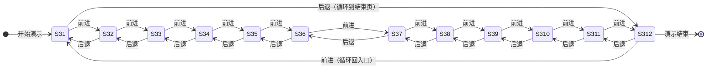

# PPT 演示重构文档

## 1. 文档定位

本文档用于记录本分支的演示化改造目标、交互原则、页面调整方向和待确认事项。

本分支的定位不是继续完善 PM 原型，也不是直接建设生产功能，而是为了方便甲方向上级汇报演示，将当前 HTML demo 改造成更接近“大屏 PPT 演示”的形态。

本文档先作为开发前的共识稿。待演示人、产品或项目负责人补充确认后，再进入代码改造。

## 2. 背景与目标

当前页面整体更接近可操作原型：页面信息较多，按钮、输入框、弹窗、滚动区域和局部交互较丰富，适合产品讲解和功能走查。

本分支的目标是让演示人可以像操作 PPT 一样推进流程：

1. 大部分场景下，点击鼠标即可自动进入下一步。
2. 键盘左 / 右方向键分别对应上一步 / 下一步。
3. 页面内容适合会议室大屏观看，重点信息更大、更少、更聚焦。
4. 保留现有业务叙事主线，但弱化真实用户填写、选择、上传、输入等复杂操作。
5. 演示过程尽量稳定、可控、可回退，避免现场卡在某个按钮、弹窗、输入框或滚动区域。

## 3. 页面改造记录

本节 3.1–3.12 对应 PPT 演示的**页级顺序**（非左侧导航分组顺序）。演示人可通过右下角「后退 / 前进」按钮，或键盘方向键，在相邻 PPT 页之间切换。

### 3.0 PPT 页级状态转移

| PPT 页 | 页面文件 | 说明 |
| --- | --- | --- |
| 3.1 | `index.html` | 演示入口；按后退 / 左方向键循环到 3.12 |
| 3.2 | `申请书bot.html` | AI 生成申请书 |
| 3.3 | `Step2SmartExtraction.html` | 材料智能提取 |
| 3.4 | `立案分流智能判断.html` | 立案分流智能判断 |
| 3.5 | `调解&撤案引导bot.html` | 纠纷化解引导 |
| 3.6 | `抗辩机器人.html` | 抗辩模拟 |
| 3.7 | `游戏化问答.html` | 案情闯关 |
| 3.8 | `案件路径图.html` | 路径对比 |
| 3.9 | `申请书bot.html?demoStage=report` | 案件评估报告 |
| 3.10 | `立案提交后路径选择.html` | 立案后路径选择 |
| 3.11 | `当事人画像话术策略.html` | 当事人画像 / 话术策略 |
| 3.12 | `演示结束页.html` | 结束页；再按前进 / 右方向键回到 3.1 |

**页级导航控件**

- 实现文件：`assets/demo-shell/demo-ppt-nav.js`、`assets/demo-shell/demo-ppt-nav.css`
- 右下角固定显示「后退」「前进」按钮
- 默认键位：左方向键（上一页）、右方向键（下一页）
- 键位与开关写入 `localStorage`，可在控制台直接修改：

| localStorage key | 默认值 | 含义 |
| --- | --- | --- |
| `isShowPptNavControls` | `0` | 是否显示 PPT 前进 / 后退**按钮**（仅控制 UI；键盘左右键跳转逻辑始终生效） |
| `pptNavKeyCodePrev` | `37` | 上一页键位 keyCode（左方向键） |
| `pptNavKeyCodeNext` | `39` | 下一页键位 keyCode（右方向键） |

页内逐帧 / 逐题交互仍优先使用**鼠标点击**；若某页注册了页内键盘处理（如 3.7 闯关、3.9 报告分步），则同键位先推进页内状态，未消费时才触发页级切换。

### 3.1 index.html

本页作为演示入口页，先按 PPT 演示节奏简化首屏信息，减少非主线内容干扰。

改造要求：

1. 去掉左侧视频模块 `left-video-card`。
2. 点击“暂无申请书，AI 对话生成申请书”后，直接跳转到 next：`申请书bot.html`。

### 3.2 申请书bot.html

本页作为“暂无申请书，AI 对话生成申请书”的演示页面，重点从真实对话操作改为 PPT 式分帧展示，减少现场输入、等待和辅助工具干扰。

改造要求：

1. 去掉右侧“辅助工具”卡片区域 `ai-side-tools`。
2. 对话框交互做精简：按照 PPT 交互，鼠标点击后直接 next 到下一帧，当前帧所需对话一次性呈现，省略中间输入和打字机过程。
3. 如果一次性呈现涉及代码改动过大，可退而采用“快速打字机”方式，让本帧全部对话快速呈现，避免现场长时间等待。
4. 对话文案内容需要调整，具体文案待 PM 后续提供。

### 3.3 Step2SmartExtraction.html

本页作为“已有申请书”路径进入后的材料上传与智能提取页面，PPT 演示中需要省去重复上传和点击下一步等真实操作，直接展示材料已准备好的状态。

改造要求：

1. 入口来自首页 `index.html` 点击“已有申请书”，直接 next 到本页，省去在首页点击“下一步”的操作。
2. 所有证件材料省去用户手动上传过程。
3. PM 后续会提供原文件，统一放在 `assets/pdf` 目录下。
4. 进入本页后，由 next 触发自动上传好 6 份文件：
   - 1 份仲裁申请书。
   - 1 份证据目录。
   - 2 份证据 1 的文件。
   - 2 份证据 2 的文件。
5. 如果真实自动上传实现成本较高，可改为假占位展示，表现为对应位置已经上传了 PDF 文件，并显示文件名和文件大小。

### 3.4 立案分流智能判断.html

本页承接材料提交后的分流展示，说明系统如何识别案件类型并判断是否进入调解准入类型。

改造要求：

1. 页面内容以 PM 提供的 `立案分流智能判断.html` 原型为准。
2. 已接入 PPT 页级导航；演示人可通过方向键或右下角按钮在 3.3 ↔ 3.4 ↔ 3.5 之间切换。

### 3.5 调解&撤案引导bot.html

本页作为提交材料后用于引导当事人进入调解或撤案相关路径的 bot 页面，需要按 PPT 演示方式弱化真实输入操作。

改造要求：

1. 页面名称改为：智能纠纷化解引导助手。
2. 对话框交互与 `申请书bot.html` 保持一致：按照 PPT 交互，鼠标点击后直接 next 到下一帧，当前帧所需对话一次性呈现，省略中间输入和打字机过程。
3. 如果一次性呈现涉及代码改动过大，可退而采用“快速打字机”方式，让本帧全部对话快速呈现，避免现场长时间等待。
4. 与其他 bot 不同的是：输入框上方新增三个选项卡，用于引导当事人输入。
5. 三个选项卡的具体内容待 PM 输出；PM 内容确认前先不实现。

### 3.6 抗辩机器人.html

本页作为 AI 模拟被申请人抗辩的演示页面，需要按 PPT 演示方式弱化真实输入和等待过程。

改造要求：

1. 对话框交互参考 `申请书bot.html` 的 PPT 化处理：鼠标点击后直接 next 到下一帧，当前帧所需对话一次性呈现，省略中间输入和打字机过程。
2. 如果一次性呈现涉及代码改动过大，可退而采用“快速打字机”方式，让本帧全部对话快速呈现，避免现场长时间等待。

### 3.7 游戏化问答.html

本页作为案情闯关问答页面，PPT 演示中需要弱化真实答题操作，改为按演示节奏逐题推进。

改造要求：

1. 案情闯关 1-5 答题环节，不再要求点击具体选项。
2. 演示人点击屏幕内任意位置，或按键盘右方向键，直接 next 到下一题。
3. 最后一题结束后不展示报告，直接 next 跳转至 `案件路径图.html` 页面。

### 3.8 案件路径图.html

本页作为调解 / 仲裁路径对比展示页，PPT 演示中应减少中间点击展开操作，并提升大屏内容铺满程度。

改造要求：

1. 省去中间时间轴的点击交互，进入页面后直接全部展开所有时间轴内容，相当于已自动点击全部节点。
2. 时间轴展开动画可以省略；如保留动画，则需要明显加速，以免影响演示节奏。
3. 减小 `work-area` 左右留白，减少左右外边距和内边距，让大屏展示时内容更铺满屏幕。

### 3.9 案件评估报告

页面入口：`申请书bot.html?demoStage=report`。

本页作为案件评估报告展示页，PPT 演示中需要减少内部局部滚动和按钮点击操作，让报告更接近页面级展示。

改造要求：

1. 去除报告内部容器的局部滚动样式 `flex-1 overflow-y-auto p-8 space-y-8 bg-slate-50 custom-scrollbar`，改为页面级别的纵向滚动条。
2. 去掉概率展示区域 `flex flex-col items-center mb-8`。
3. 去掉“查看维权策略推荐”按钮，改为点击屏幕任意位置或按键盘右方向键可 next 进入下一步，相当于点击了“查看维权策略推荐”。

### 3.10 立案提交后路径选择.html

改造要求：

1. 隐藏右上角的 `back-link` 区域。
2. 用户点击 `card-grid` 外面的部分时，跳转到 `当事人画像话术策略.html`（3.11）。
3. 支持键盘右方向键 next 到 3.11，与 PPT 演示交互保持一致。

### 3.11 当事人画像/话术策略

新增 HTML 页面：`当事人画像话术策略.html`。

改造要求：

1. 页面内容以 PM 提供的 `mediator_dashboard.html` 原型为准。
2. 当前先接入演示导航；后续交互要求待 PM 再补充。
3. 点击页面任意位置，或按键盘右方向键，next 到 `演示结束页.html`（3.12）。

### 3.12 结束页

新增 HTML 页面：`演示结束页.html`，作为 PPT 演示流程的结束页。

改造要求：

1. 页面内容以 PM 提供的 `演示结束页.html` 原型为准。
2. 文案：努力为每一起纠纷，提供最佳解决方案。
3. 页面需要带广仲 logo（`./图片/广仲logo.png`）。
4. 当前先接入演示导航；3.12 再按前进 / 右方向键循环回到 3.1，便于收尾后衔接下一轮演示。
