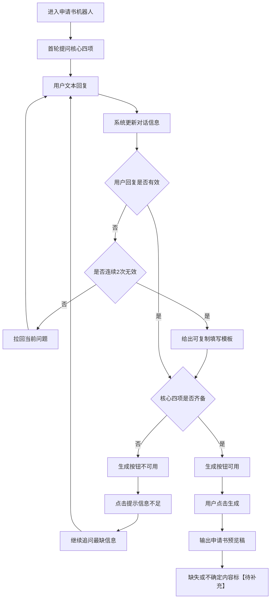

# 申请书机器人开发产品需求文档

## 1. 项目背景

### 1.1 需求简介
- 在 `申请书bot.html` 页面中，提供一个只靠文本对话收集信息、并生成仲裁申请书预览稿的能力。
- 页面不做附件上传，不做材料识别，不做证据整理。
- 用户只要把核心信息说清，系统就尽量生成一份可直接核对的申请书。

### 1.2 业务目标
- 让用户用尽量少的操作完成申请书草稿生成。
- 让开发拿到的规则清晰、边界明确，不靠临场理解提示词。
- 让信息不全时仍能出稿，缺失部分统一写成【待补充】。

### 1.3 范围边界
- 本页只做文本对话采集和申请书预览生成。
- 不做附件上传。
- 不做文字识别或证据文件识别。
- 不做预览稿二次修改后重新生成。
- 不做字段来源展示或保存。
- 不做证据目录、证据清单和“证据和证明事项”部分。

## 2. 业务流程简述

### 2.1 主流程
1. 用户进入申请书机器人页面。
2. 系统先发起首轮提问，要求用户用一段话说清四件事。
3. 用户按多轮对话补充信息。
4. 系统按固定顺序收集信息，并把不确定内容记为【待补充】。
5. 当核心四项满足后，生成按钮可用。
6. 用户点击生成后，系统输出申请书预览稿。
7. 预览稿中缺失、不确定、未正面回复的信息，统一保留【待补充】。

### 2.2 核心四项
1. 申请人是谁。
2. 对方是谁。
3. 想让对方承担什么责任。
4. 事情大概怎么发生的。

### 2.3 结果要求
- 只要核心四项齐备，其他信息可以缺。
- 不能因为地址、电话、仲裁条款、金额细节不全就阻止生成。
- 不能把用户没说清的内容直接补成确定事实。

## 3. 详细功能说明

### 3.1 页面初始状态
1. 页面默认进入采集状态。
2. 生成按钮默认不可用。
3. 页面不显示附件上传入口。
4. 页面不显示证据文件相关入口。
5. 页面只引导用户做文本表达。

### 3.2 首轮提问
1. 首轮必须直接引导用户说清核心四项。
2. 首轮问题不能一次列出太多字段。
3. 首轮表达要短，用户容易直接回答。
4. 首轮允许用户直接写“暂不清楚”。

### 3.3 多轮追问
1. 每轮最多追问2个问题。
2. 每轮优先追问最影响申请书生成的信息。
3. 已经说清的内容要先复述确认。
4. 不确定内容要用“我理解为……是否准确？”的方式确认。
5. 不要让用户一次填满全部字段。

### 3.4 固定采集顺序
1. 先收申请人。
2. 再收被申请人。
3. 再收主要仲裁请求。
4. 再收基本事实经过。
5. 再收金额。
6. 再收合同或交易关系。
7. 再收仲裁条款或管辖依据。
8. 最后补齐送达地址、日期、代理人等次要信息。

### 3.5 无效回复处理
1. 用户只说“你帮我写”“随便写”时，系统不能直接生成，应要求其先补核心四项。
2. 用户答非所问时，系统先简短回应，再拉回当前问题。
3. 用户说“不知道”“不清楚”“没有”时，当前项记为【待补充】，继续问下一项。
4. 用户连续2次无效回复时，系统给出可复制的填写模板。
5. 用户连续3次无效回复时，如果核心四项不齐，只盯着最缺的一项继续追问，不要扩散到别的字段。
6. 用户连续3次无效回复时，如果核心四项已齐，不继续追问次要字段，可提示用户生成待补充版。

### 3.6 生成条件
1. 申请人姓名或名称齐备。
2. 被申请人姓名或名称齐备。
3. 主要仲裁请求齐备。
4. 基本事实经过齐备。
5. 上述四项缺任意一项，生成按钮不可用。
6. 上述四项齐备后，生成按钮可用。

### 3.7 申请书预览生成
1. 用户点击生成后，系统输出一份申请书预览稿。
2. 预览稿必须按仲裁申请书的标准结构输出。
3. 用户说不清、没说、前后冲突的信息，全部在对应位置标【待补充】。
4. 不允许把缺失信息当成已确认事实写死。
5. 预览稿只生成一次，不提供在同一稿件上继续修改再生成的流程。

### 3.8 申请书正文规则
1. 申请人、被申请人、仲裁请求、事实与理由、落款必须齐全。
2. 事实与理由按时间顺序写。
3. 金额尽量明确。
4. 请求要分项列明。
5. 申请书正文里不写证据目录式内容。
6. 不写“最终版”字样。

### 3.9 待补充规则
1. 用户没有说清的内容，统一写【待补充】。
2. 用户只说了大概但没说准的内容，统一写【待补充】。
3. 用户明确说不清楚的内容，统一写【待补充】。
4. 不能把模型猜测写成确定事实。

## 4. 流程与状态图表

## 5. 异常与降级

### 5.1 用户长期不正面回答
1. 先给填写模板。
2. 模板后仍无效，就继续追问最缺的一项。
3. 如果核心四项一直不齐，不允许生成。

### 5.2 用户内容前后冲突
1. 同一信息出现多个版本时，优先采用用户最后明确确认的版本。
2. 如果无法判断哪个版本有效，写【待补充】。
3. 不允许系统自行替用户选一个版本。

### 5.3 用户信息不完整但已够生成
1. 只要核心四项齐备，就可以生成。
2. 其他字段缺失时，在对应位置标【待补充】。
3. 不因为次要字段缺失阻断流程。

### 5.4 用户要求直接生成
1. 核心四项不齐时，直接拒绝生成。
2. 核心四项齐时，可以生成待补充版。
3. 不允许生成“看着写”的空壳申请书。

## 6. 验收标准

### 6.1 功能验收
1. 页面没有附件上传入口。
2. 页面只通过文本对话收集信息。
3. 核心四项齐备后，生成按钮可用。
4. 核心四项不齐时，生成按钮不可用。
5. 生成结果中缺失内容都标成【待补充】。

### 6.2 交互验收
1. 首轮提问短，用户能直接回答。
2. 每轮最多追问2个问题。
3. 用户答非所问时，系统会拉回当前问题。
4. 用户连续无效回复时，系统会给填写模板。

### 6.3 文书验收
1. 申请书结构完整。
2. 事实与理由按时间顺序表达。
3. 不出现证据目录式内容。
4. 不出现“最终版”字样。
5. 不把模型猜测写成确定事实。

### 6.4 交付验收
1. 开发拿到这份产品需求文档后，可以直接按页面流程开发。
2. 开发不会误以为本页需要附件上传或证据识别。
3. 开发不会误以为生成后还要支持同稿二次修改再生成。
4. 开发可以按核心四项做按钮状态控制。
